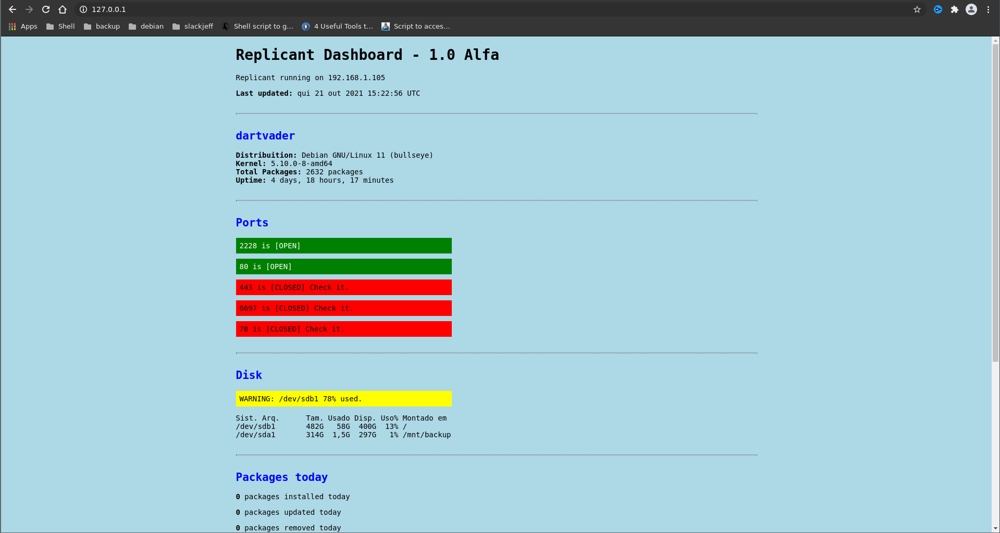
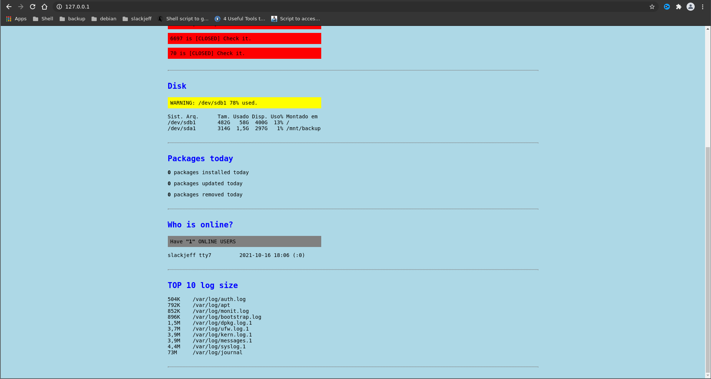
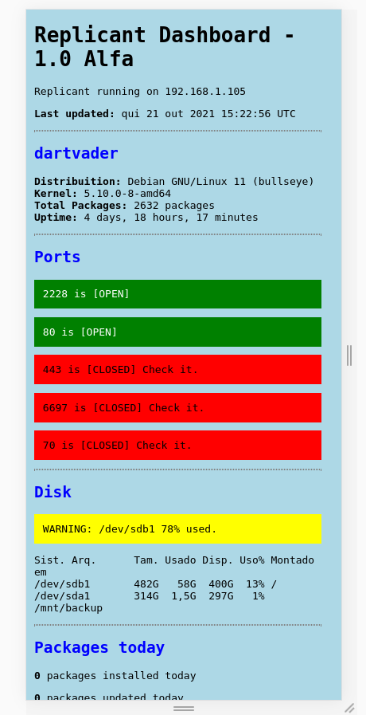

# replicant
Script that make simple system monitoring and make html page.

## How work?

The need for monitoring a VPS made me create this script;
It monitors the following items that I think are important:

* System info: distribuition, kernel, total packages, Uptime
* Ports services [open] or [down]
* Disk usage
* Packages: Installed, removed and updated (today)
* Top 10 logs size

Every script is executed and outputs to a '.html file', which you can view in your local network or even over the internet.
For internet viewing it is recommended authentication by apache or nginx.

### Example 1

### Example 2

### Responsive mode

## Install and test
Clone repo
`git clone https://github.com/slackjeff/replicant/`

Enter directory repo and give permission on script.
`cd replicant && chmod u+x replicant`

Copy script to /usr/local/bin/
`sudo cp replicant /usr/local/bin/`

### Put on cron
`crontab -e
* * * * * /usr/local/bin/replicant > /var/www/html/replicant.html`
